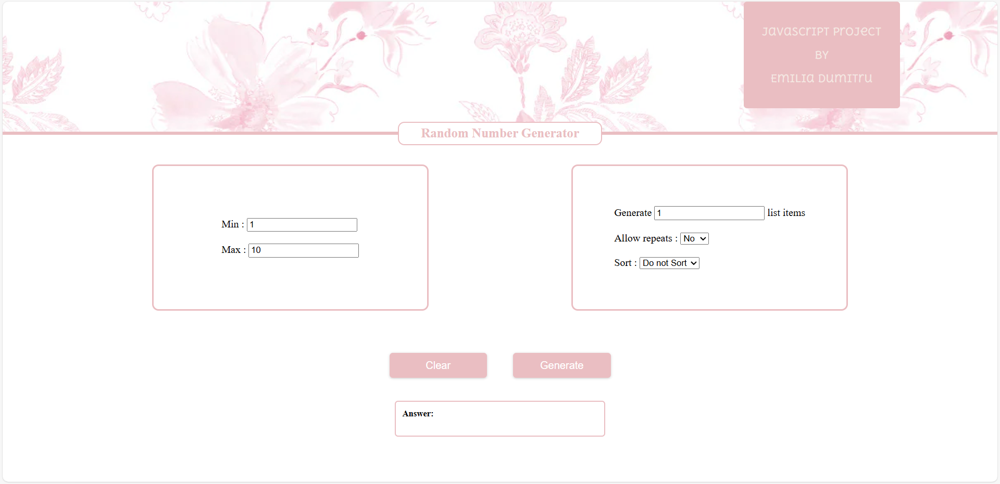

# 🎲 Random Number Generator 🎲

## Description 📜
This project is a random number generator built with HTML, CSS, and JavaScript. It allows users to generate random numbers within a specified range, choose how many numbers to generate, and apply additional options such as sorting and repeating numbers.

## 🚀 Features
- ✅ Generate a random number between a specified range.
- ✅ Choose how many numbers to generate.
- ✅ Option to allow number repetition.
- ✅ Option to sort numbers (High to Low, Low to High, or no sorting).
- ✅ Fully responsive interface for mobile and desktop devices.

## 🛠 Technologies Used
- **HTML5** - For the structure of the page.
- **CSS3** - For styling and responsive design.
- **JavaScript** - For the logic of generating random numbers and interactivity.

## 📸 Demo


## 🔧 Installation
To run this project locally, follow these steps:

1. Clone this repo:
    ```bash
    git clone https://github.com/username/random-number-generator.git
    ```

2. Open the `index.html` file in your browser.

## 🔍 How It Works?

### Step 1: Set the Range
In the "Min" and "Max" fields, enter the values between which you want to generate random numbers. The default "Min" value is 1, and the default "Max" value is 10.

### Step 2: Choose Number of Items
Enter how many numbers you want to generate in the "Generate list items" field.

### Step 3: Additional Options
- **Allow repeats**: Enable or disable number repetition.
- **Sort**: Choose how you want to sort the numbers (High to Low, Low to High, or no sorting).

### Step 4: Generate the Numbers
Click the "Generate" button to generate the random numbers based on your settings. The results will appear in the "Answer" section.

## 💻 Project Files

- `index.html`: The main HTML file of the application.
- `styles.css`: The CSS file that defines the styling for the page.
- `index.js`: The JavaScript file containing the logic for generating random numbers.
- `imgs/`: Folder containing images used in the project (e.g., for the header).

## 🌱 Contributing
Contributions are welcome! If you have suggestions or improvements, feel free to open an issue or submit a pull request.

### License
This project is licensed under the MIT License - see the [LICENSE](LICENSE) file for details.


